# yolov5代码复现
个人作业
## 1.主干网络
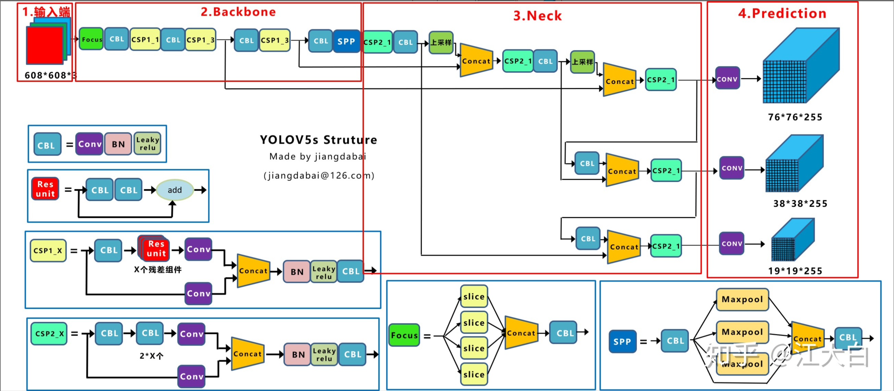
可以通过上图看到yolo还是分为4部分的，1.输入端 2.主干网络 3.Neck 4.prediction

（1）输入端：Mosaic数据增强、自适应锚框计算、自适应图片缩放    
（2）Backbone：Focus结构，CSP结构     
（3）Neck：FPN+PAN结构     
（4）Prediction：GIOU_Loss    

### 1.1 输入端
#### 1.1.1 Mosaic数据增强
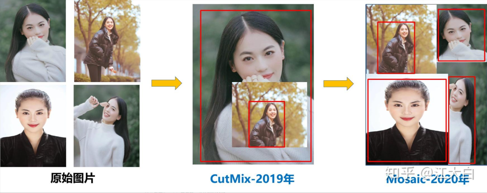
随机缩放、随机裁剪、随机排布的方式进行拼接

#### 1.1.2 自适应锚框计算
在Yolo算法中，针对不同的数据集，都会有初始设定长宽的锚框。   
在网络训练中，网络在初始锚框的基础上输出预测框，进而和真实框Ground_truth进行比对，计算两者差距，再反向更新，迭代网络参数。   
因此初始锚框也是比较重要的一部分，比如Yolov5在Coco数据集上初始设定的锚框：      
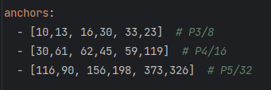      
Yolov5中将此功能嵌入到代码中，每次训练时，自适应的计算不同训练集中的最佳锚框值。     

#### 1.1.3 自适应图片缩放
在常用的目标检测算法中，不同的图片长宽都不相同，因此常用的方式是将原始图片统一缩放到一个标准尺寸，再送入检测网络中。    
比如Yolo算法中常用416*416，608*608等尺寸，比如对800*600的图像进行缩放。    
在yolov5官方文件中有相关代码：augmentation.py的letterbox函数中也有详细的代码。    
**第一步：计算缩放比例**
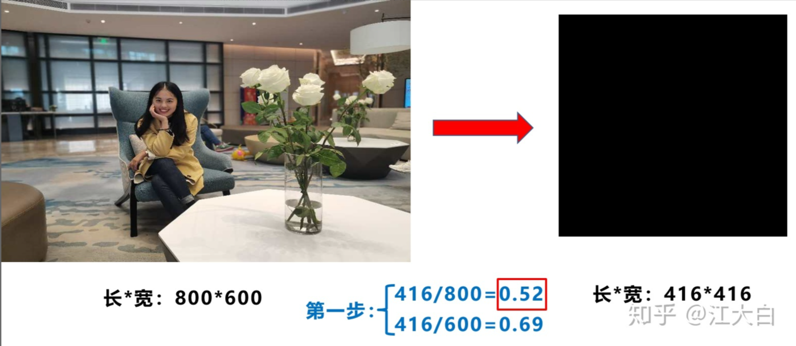    
原始缩放尺寸是416*416，都除以原始图像的尺寸后，可以得到0.52，和0.69两个缩放系数，选择小的缩放系数。   
**第二步：计算缩放后的尺寸**   
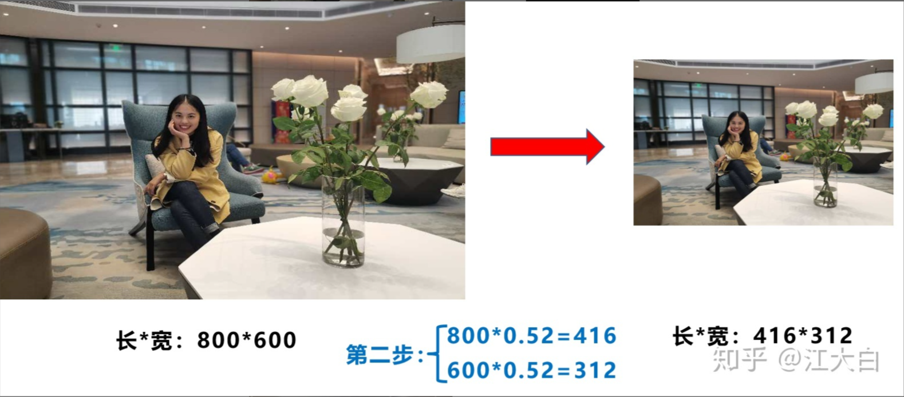
原始图片的长宽都乘以最小的缩放系数0.52，宽变成了416，而高变成了312。   
**第三步：计算黑边填充数值**
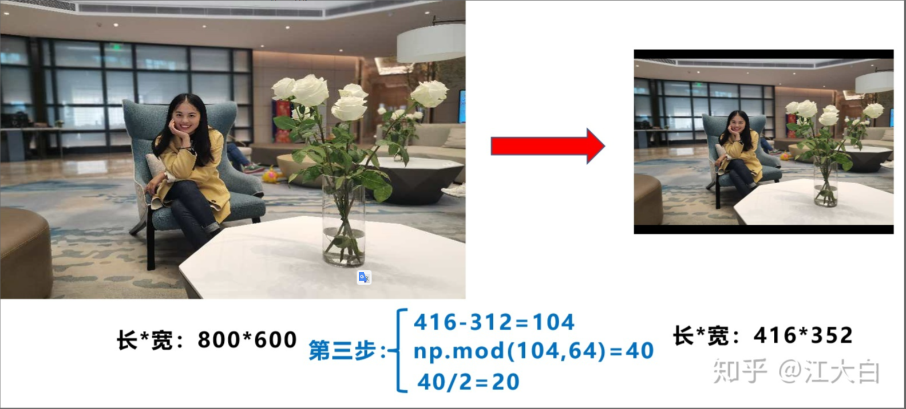
将416-312=104，得到原本需要填充的高度。再采用numpy中np.mod取余数的方式，得到40个像素，再除以2，即得到图片高度两端需要填充的数值。    
训练时没有采用缩减黑边的方式，还是采用传统填充的方式，即缩放到416*416大小。只是在测试，使用模型推理时，才采用缩减黑边的方式，提高目标检测，推理的速度。   

### 1.2 Backbone
#### 1.2.1 Focus结构
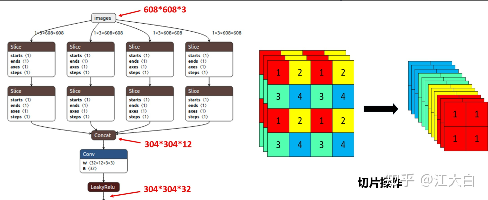
在新的yolov5-7.0的版本去掉了Focus结构，因为似乎没法证明这玩意有用
#### 1.2.2 CSP结构
Yolov5中设计了两种CSP结构，以Yolov5s网络为例，CSP1_X结构应用于Backbone主干网络，另一种CSP2_X结构则应用于Neck中。    
#### 1.2.3 Neck
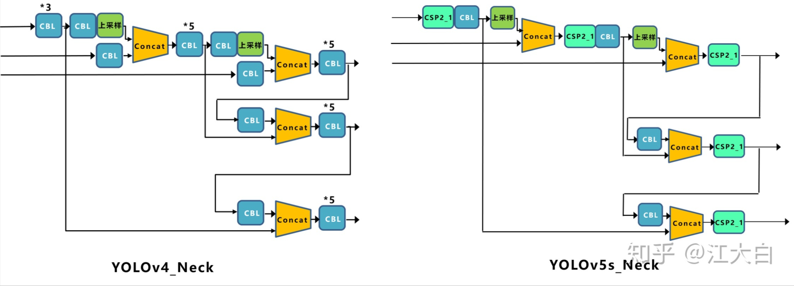    

### 1.2 输出端    
#### 1.2.1 Bounding Box损失函数
Yolov5中采用其中的CIOU_Loss做Bounding box的损失函数。   
CIOU_Loss和DIOU_Loss前面的公式都是一样的，不过在此基础上还增加了一个影响因子，将预测框和目标框的长宽比都考虑了进去。    
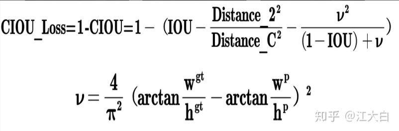    
#### 1.2.2 NMS非极大值抑制
DIOU_mns

## 2 YOLOv5网络结构
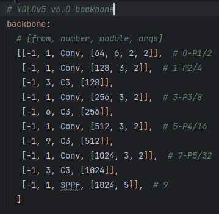   
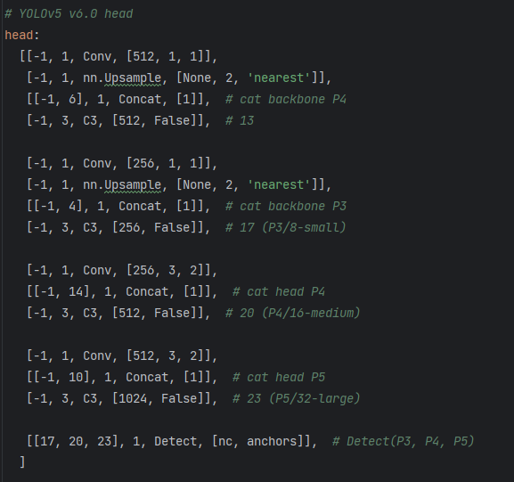   

自己实现太难了，参考一下github上的nb库，还就那个参考

